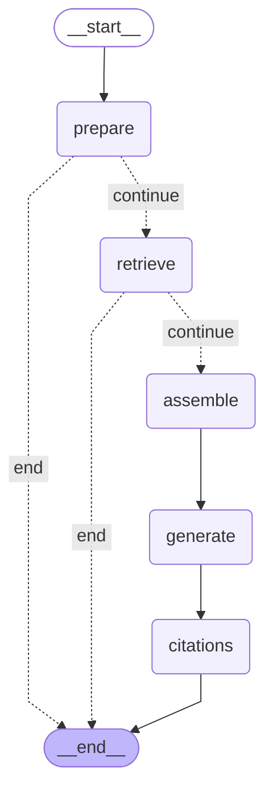

# 第 11 周：线性 RAG 工作流

接收问题 → 索引检查 → 检索 → 装配上下文 → 生成 → 引用校验。
虚线为条件边，用于两条短路路径（索引未就绪 / 检索无命中直接结束，不发 LLM）。

> 本图由 `python scripts/render_graphs.py` 从代码自动生成（`graph.get_graph().draw_mermaid()`），
> 不是手绘 —— 改图结构后重跑脚本即可同步。

