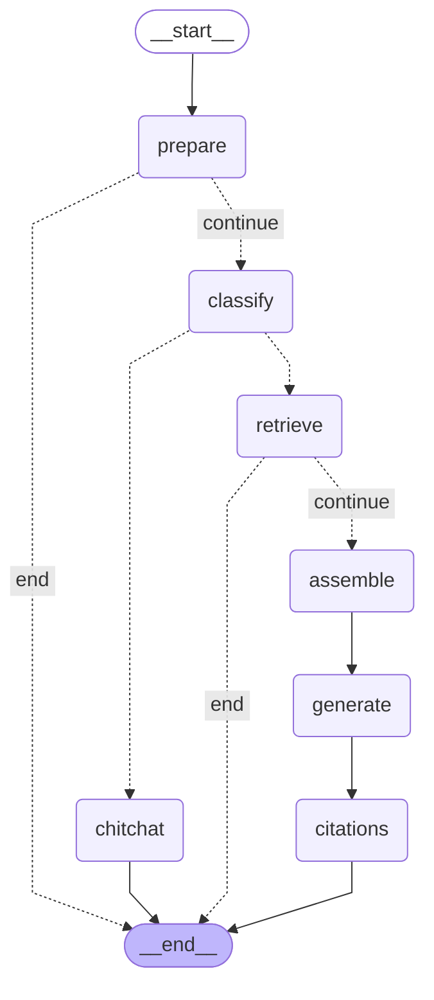

# 第 12 周：条件分支 RAG

按查询类型（事实 / 推理 / 闲聊）路由到不同的检索策略。

> 本图由 `python scripts/render_graphs.py` 从代码自动生成（`graph.get_graph().draw_mermaid()`），
> 不是手绘 —— 改图结构后重跑脚本即可同步。

```mermaid
---
config:
  flowchart:
    curve: linear
---
graph TD;
	__start__([<p>__start__</p>]):::first
	prepare(prepare)
	classify(classify)
	chitchat(chitchat)
	retrieve(retrieve)
	assemble(assemble)
	generate(generate)
	citations(citations)
	__end__([<p>__end__</p>]):::last
	__start__ --> prepare;
	assemble --> generate;
	classify -.-> chitchat;
	classify -.-> retrieve;
	generate --> citations;
	prepare -. &nbsp;end&nbsp; .-> __end__;
	prepare -. &nbsp;continue&nbsp; .-> classify;
	retrieve -. &nbsp;end&nbsp; .-> __end__;
	retrieve -. &nbsp;continue&nbsp; .-> assemble;
	chitchat --> __end__;
	citations --> __end__;
	classDef default fill:#f2f0ff,line-height:1.2
	classDef first fill-opacity:0
	classDef last fill:#bfb6fc

```
