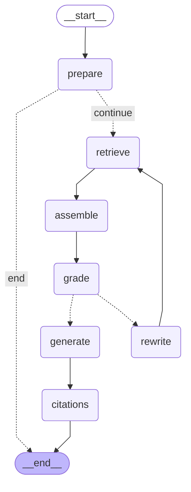

# 第 12 周：循环检索（Self-RAG 骨架）

检索 → 相关性评分 → 不达标则重写查询 → 重新检索。
回边（rewrite → retrieve）形成循环，由重写次数上限 + 相关性阈值双重终止。

> 本图由 `python scripts/render_graphs.py` 从代码自动生成（`graph.get_graph().draw_mermaid()`），
> 不是手绘 —— 改图结构后重跑脚本即可同步。

