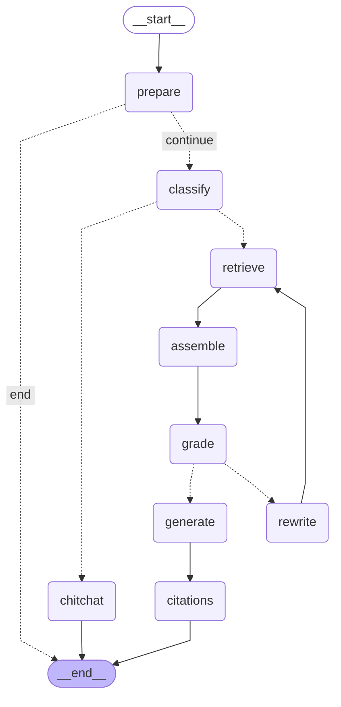

# 第 13 周：Agentic RAG 完整链路

查询分类 →（闲聊直答 | 检索 → 相关性评估 → 重写循环）→ 生成 → 引用。
在 Self-RAG 骨架上叠加查询分类分支。

> 本图由 `python scripts/render_graphs.py` 从代码自动生成（`graph.get_graph().draw_mermaid()`），
> 不是手绘 —— 改图结构后重跑脚本即可同步。

