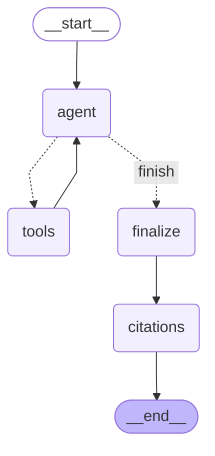

# 第 13 周：ReAct 工具调用

agent（模型自主决定调不调工具）⇄ tools（执行工具）。
回边（tools → agent）形成 ReAct 循环，由工具轮次上限终止。
finalize 节点用标准引用管线重生成答案（修复 ReAct 模式引用率为 0 的问题）。

> 本图由 `python scripts/render_graphs.py` 从代码自动生成（`graph.get_graph().draw_mermaid()`），
> 不是手绘 —— 改图结构后重跑脚本即可同步。

